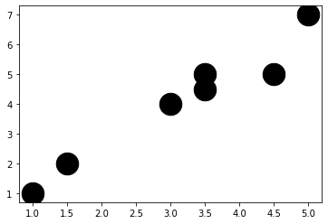
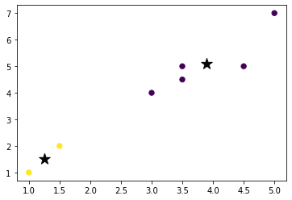
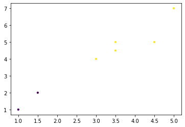

```bash
  $ python prgm8.py
```

## Output

```
Input Data and Shape
(7, 3)
   Unnamed: 0   V1   V2
0           1  1.0  1.0
1           2  1.5  2.0
2           3  3.0  4.0
3           4  5.0  7.0
4           5  3.5  5.0
f1
[1.  1.5 3.  5.  3.5 4.5 3.5]
x
[[1.  1. ]
 [1.5 2. ]
 [3.  4. ]
 [5.  7. ]
 [3.5 5. ]
 [4.5 5. ]
 [3.5 4.5]]
Graph for whole dataset

 labels
[1 1 0 0 0 0 0]
centroids
[[3.9  5.1 ]
 [1.25 1.5 ]]
Graph using Kmeans Algorithm

lLABELS GMM
[1 1 0 0 0 0 0]
Graph using EM Algorithm


```
